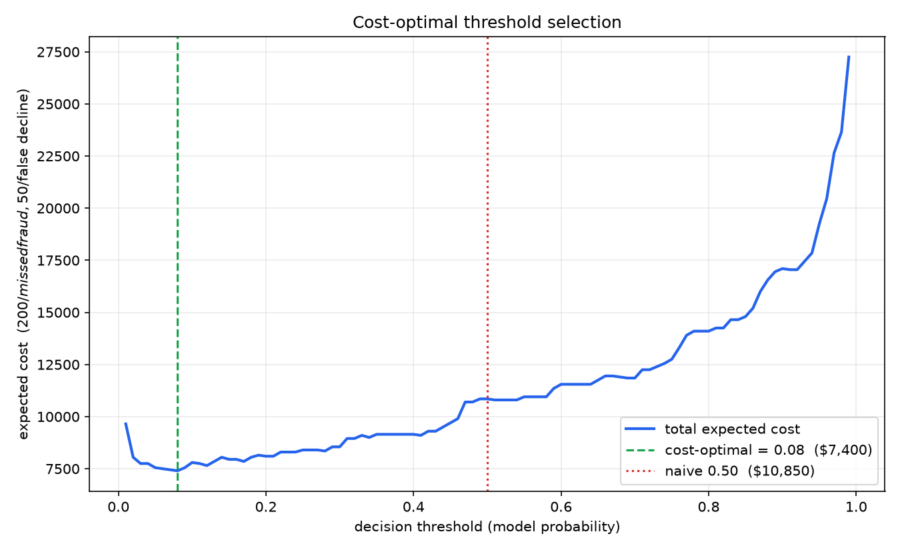

# Sentinel — Real-Time Card Fraud Detection

A backend scoring service that evaluates card transactions in real time and routes each one
to `APPROVE`, `REVIEW`, or `DECLINE`. Built end to end: a synthetic transaction simulator, a
point-in-time feature pipeline, a gradient-boosted model, and a FastAPI service that scores a
transaction in roughly 12 ms.

The emphasis is on the parts of a fraud system that are easy to get quietly wrong — target
leakage, threshold selection, and training/serving consistency — rather than on the model
itself.

---

## Architecture

```
  generate_data.py                                  ┌────────────────┐
  (synthetic world) ──────────────────────────────► │  sentinel.db   │
                                                    │    (SQLite)    │
                          ┌───── account history ───┤                │
                          │                         └────────▲───────┘
                          ▼                                  │
  POST /score      ┌──────────────────────┐                  │
  {transaction} ──►│   FastAPI service    │                  │
                   │  1. load history     │                  │
                   │  2. compute 16 feats │──► model.joblib  │
                   │  3. score            │    (XGBoost)     │
                   │  4. apply policy     │                  │
                   └──────────┬───────────┘─── decision ─────┘
                              ▼
              APPROVE  <0.05    REVIEW  0.05–0.90    DECLINE  ≥0.90
```

A request arrives with a single transaction and no history. The service loads that account's
prior transactions from SQLite under a strict as-of cutoff, computes 16 behavioural features
live, scores them, applies a cost-optimised policy, and persists the decision.

---

## Results

Evaluated on the final 20% of the timeline — 37,857 transactions, 332 of them fraud (0.88%).

| model | PR-AUC | vs. no-skill |
|---|---|---|
| no-skill baseline (test fraud rate) | 0.0088 | 1× |
| logistic regression | 0.8628 | 98× |
| **XGBoost** | **0.9610** | **110×** |
| XGBoost, labels shuffled | 0.0068 | below baseline |

Accuracy is not reported: fraud is 1 in 145 transactions here, so a model that always answers
"not fraud" scores 99.1%. ROC-AUC is also omitted — at this level of class imbalance it
flatters everything, because its denominator is dominated by the 37,525 legitimate rows.
PR-AUC is the metric that penalises false positives proportionally.

Detection rate by fraud type at `p ≥ 0.5`:

| pattern | recall |
|---|---|
| card testing | 96.4% |
| impossible travel | 84.3% |
| account takeover | 72.0% |
| false positive rate | 0.035% |

The ordering tracks how much signal each pattern was designed to leave. Card testing produces
an unmistakable velocity signature; account takeover is deliberately built to overlap with
legitimate behaviour, since real customers do occasionally spend several times their norm at
an unfamiliar merchant.

---

## Three engineering decisions

### 1. Point-in-time features and leakage control

Every rolling feature is computed from an account's prior transactions only. The loop computes
features from accumulated history, then appends the current transaction — so a transaction
cannot contribute to its own features. The train/test split is by time, never random: the
first 80% of the timeline trains, the last 20% tests.

This is verified rather than asserted. Within a card-testing burst:

| | mean `txn_count_1h` |
|---|---|
| first transaction of a burst | 0.05 |
| later transactions in the same burst | 7.28 |
| ordinary legitimate transaction | 0.05 |

The first charge of a 20-charge burst sees exactly as much history as a normal transaction —
none of its own burst. A leaking implementation would show 7–20 there.

The control test: shuffling the training labels and retraining collapses PR-AUC from **0.9610
to 0.0068**, below the no-skill line. With the feature/label relationship destroyed, the model
learns nothing — which is only true if it was learning from that relationship in the first
place.

A consequence worth stating: the model structurally cannot flag the *first* charge of a burst
on velocity features, because at that moment nothing distinguishes it. Detection begins at the
second transaction.

### 2. Thresholds chosen by expected cost

The model outputs a probability; converting it to a decision requires a cut-off, and 0.5 is an
arbitrary one. The two error types do not cost the same:

- missed fraud ≈ **$200** (the transaction is written off)
- false decline ≈ **$50** (support contact, customer friction, churn risk)

Sweeping the threshold from 0.01 to 0.99 and computing `(missed × 200) + (false_declines × 50)`
at each point:



| threshold | missed fraud | false declines | cost |
|---|---|---|---|
| 0.50 (default) | 51 | 13 | $10,850 |
| **0.08 (cost-optimal)** | 25 | 48 | **$7,400** |

The optimum sits at 0.08 because missed fraud costs 4× a false decline, making it worth
declining several legitimate customers to prevent one loss. Defaulting to 0.5 costs $3,450 on
this test set for no benefit.

Extending to two thresholds produces the three-way policy:

```
APPROVE   p < 0.05        37,484 transactions      22 frauds missed
REVIEW    0.05 ≤ p < 0.90    124 transactions      63 frauds caught by a human
DECLINE   p ≥ 0.90           249 transactions       2 legitimate customers blocked
```

Total modelled cost **$5,120**, against $10,850 at a fixed 0.5 cut-off. The review queue is
0.33% of volume — a realistic analyst workload — and hard declines are reserved for cases
where the model is nearly certain.

### 3. Offline/online feature parity

Training computes features in a single pandas pass over 189,284 rows. Serving computes them for
one transaction against history queried from SQLite. Two implementations of the same sixteen
definitions, and if they drift apart nothing fails loudly — the model is simply served inputs
that no longer match what it was trained on.

`test_parity.py` scores a stratified sample through the serving path and compares every feature
against the offline output, covering all three fraud patterns and an account's first-ever
transaction, where every history-derived feature is undefined.

```
compared 3,216 values across 201 transactions
PASS - offline and online agree on every feature
```

---

## The data

Fully synthetic, generated by `generate_data.py`: 2,000 accounts and 300 merchants across
8 US cities, producing **189,284 transactions over 90 days**.

Accounts have a per-account baseline spend, five preferred merchants they use 80% of the time,
and lognormally distributed amounts. A quarter of accounts take one multi-day trip to another
city — so distance from home is deliberately *not* a reliable fraud signal, and the model has
to learn implied speed (distance ÷ elapsed time) instead.

Three fraud typologies are planted, totalling **1,309 transactions (0.69%)**:

| pattern | accounts | transactions | signature |
|---|---|---|---|
| card testing | 60 | 773 | 6–20 charges of $0.50–$12 within 5–40 minutes at unrelated merchants |
| impossible travel | 80 | 253 | 2–4 charges in a different city 20–90 minutes after a genuine transaction |
| account takeover | 50 | 283 | 3–8 charges at 1.5–8× the account's norm at never-used merchants |

Each pattern is constructed to overlap with legitimate behaviour. Fraud amounts fall inside
normal spending ranges, the impossible-travel city pairs range from blatant to plausible, and
the 20% non-favourite rule means real customers also shop somewhere new. Without that overlap
a single `WHERE` clause would solve the problem and the model would be decorative.

---

## Running it

```bash
pip install -r requirements.txt

python init_db.py          # create tables
python generate_data.py    # 189k synthetic transactions   (~1 min)
python features.py         # build the feature table       (~3 min)
python train.py            # baseline, model, shuffle test
python cost_curve.py       # threshold sweep + cost_curve.png
python test_parity.py      # offline/online feature parity

uvicorn main:app
```

Then open `http://127.0.0.1:8000/docs`.

```bash
curl -X POST http://127.0.0.1:8000/score \
  -H "Content-Type: application/json" \
  -d '{"txn_id":"T1","account_id":"ACC00042","merchant_id":"MER0175",
       "amount":25.00,"ts":"2026-08-31T12:00:00",
       "lat":41.9053,"lon":-87.6595,"card_present":true}'
```

```json
{"decision": "APPROVE", "fraud_probability": 0.000004, "history_used": 109, "latency_ms": 11.8}
```

`features.csv` and `sentinel.db` are build artifacts and are not committed — the steps above
regenerate them.

---

## Limitations

**Because the data is synthetic, the model can only recover patterns I generated — the accuracy
figures bound what the pipeline can do, not what it would do on real card data. What the project
demonstrates is the pipeline itself: point-in-time feature construction, leakage control,
baseline comparison, and cost-based threshold selection.**

Specifically:

- Real fraud is adversarial and shifts as detection improves. These patterns are static.
- Real labels arrive late and incompletely, through chargebacks. These are perfect and immediate.
- The generator's timing and volume constants are hand-tuned estimates, not fitted to real
  card data.
- The cost figures ($200 / $50 / $5 per review) are assumptions. They are the correct *kind* of
  input for this decision, but the specific values are illustrative.
- The account-takeover pattern draws unfamiliar merchants from all cities, which gives it an
  unintended location signal and makes its recall optimistic.

---

## Stack

Python · FastAPI · SQLAlchemy · SQLite · XGBoost · scikit-learn · pandas

Transactions are indexed on `(account_id, ts)` — equality column first, range column second,
matching the only query shape the service issues: *what did this account do before this moment?*
