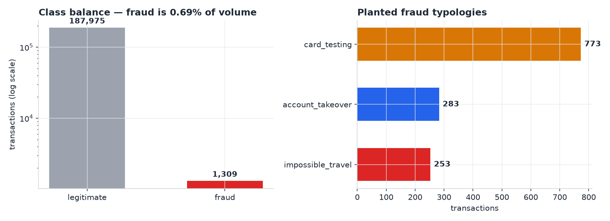
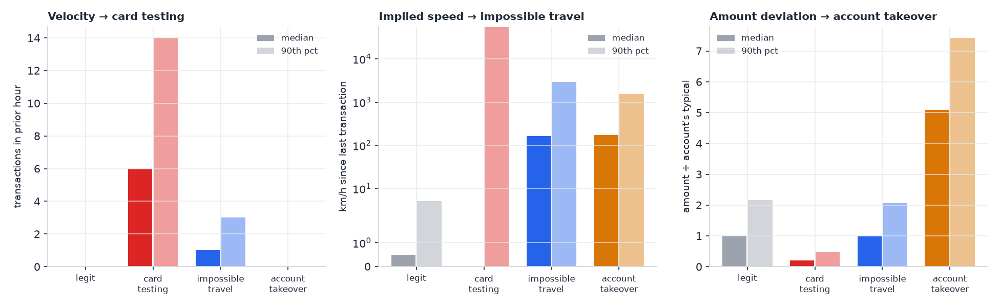
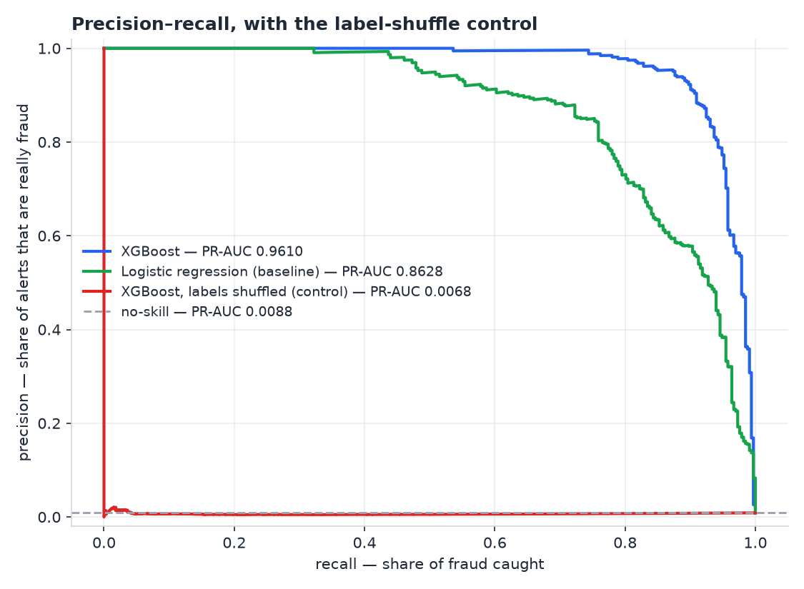
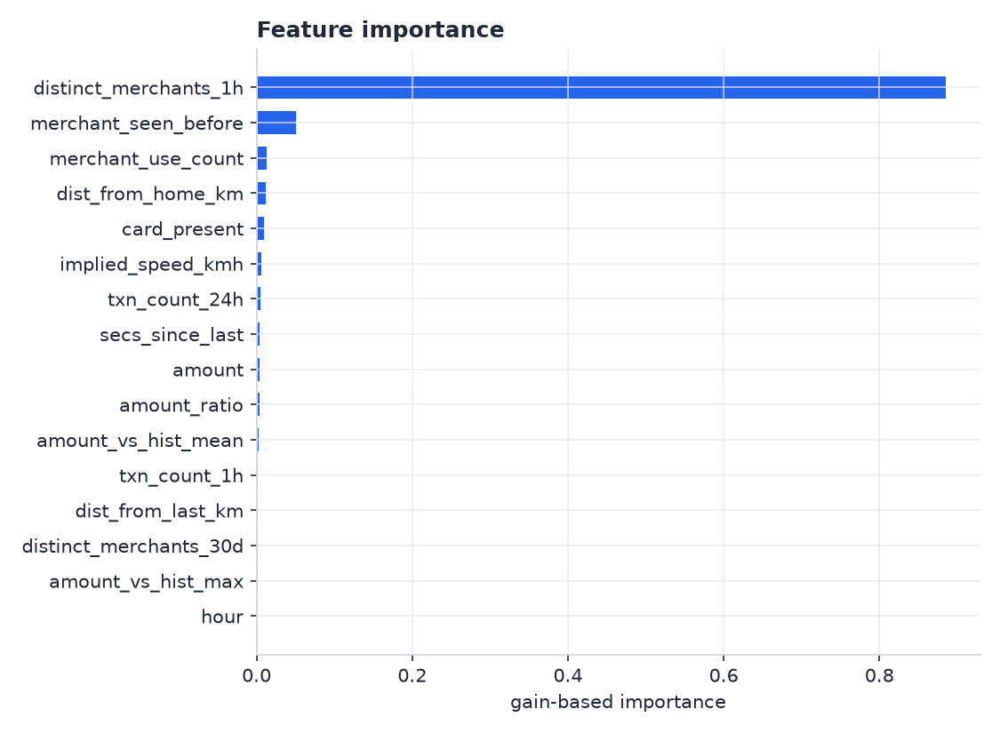
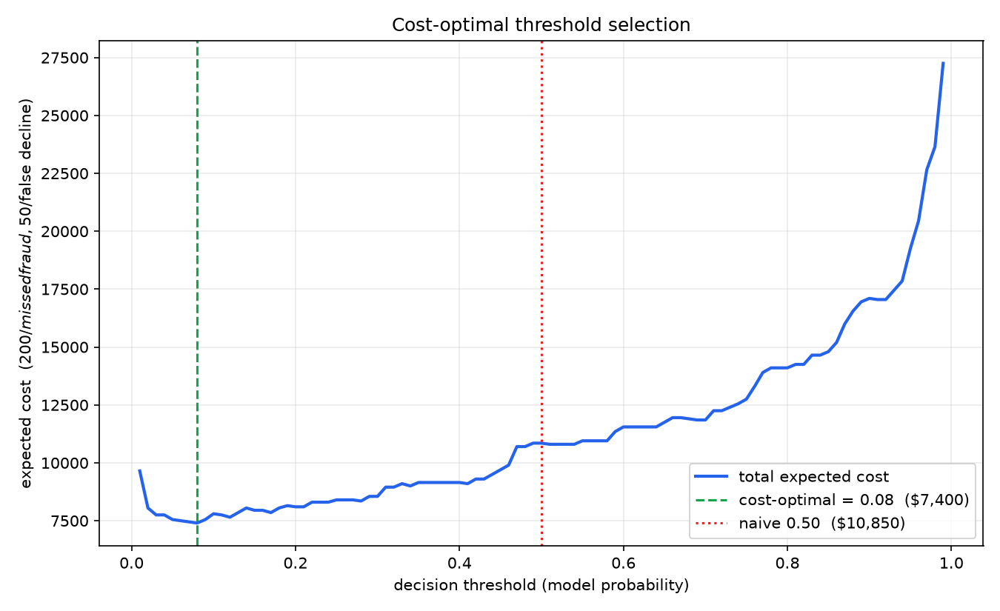
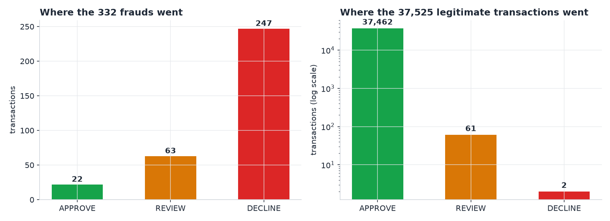

# Sentinel — Real-Time Card Fraud Detection

A backend scoring service that evaluates card transactions in real time and routes each one to
`APPROVE`, `REVIEW`, or `DECLINE`. Built end to end: a transaction simulator, a point-in-time
feature pipeline, a model selection process, cost-based threshold selection, and a FastAPI
service that scores a live transaction in roughly 12 ms.

The focus is on the parts of a fraud system that are easy to get quietly wrong — target
leakage, threshold choice, and training/serving consistency — rather than on squeezing out
accuracy.

| | |
|---|---|
| **Data** | 189,284 transactions · 2,000 accounts · 300 merchants · 90 days |
| **Fraud rate** | 0.69% (1,309 transactions across 3 typologies) |
| **Features** | 16 point-in-time behavioural features |
| **Model** | XGBoost — **PR-AUC 0.961** vs 0.863 logistic-regression baseline, 0.009 no-skill |
| **Leakage control** | label shuffle collapses PR-AUC to **0.007**, below no-skill |
| **Policy** | cost-optimised thresholds cut modelled loss **52.8%** vs a default 0.5 cut-off |
| **Serving** | ~12 ms per decision, with an offline/online feature parity test |

---

## Architecture

```
  generate_data.py                                  ┌────────────────┐
  (synthetic world) ──────────────────────────────► │  sentinel.db   │
                                                    │    (SQLite)    │
                          ┌───── account history ───┤                │
                          │                         └────────▲───────┘
                          ▼                                  │
  POST /score      ┌──────────────────────┐                  │
  {transaction} ──►│   FastAPI service    │                  │
                   │  1. load history     │                  │
                   │  2. compute 16 feats │──► model.joblib  │
                   │  3. score            │    (XGBoost)     │
                   │  4. apply policy     │                  │
                   └──────────┬───────────┘─── decision ─────┘
                              ▼
              APPROVE  <0.05    REVIEW  0.05–0.90    DECLINE  ≥0.90
```

A request arrives carrying one transaction and no history. The service loads that account's
prior transactions under a strict as-of cutoff, computes 16 behavioural features live, scores
them, applies a cost-optimised policy, and persists the decision.

---

## 1. The data

The dataset is generated rather than downloaded. That was a deliberate trade: public card-fraud
datasets are PCA-anonymised, with no account identity, no merchant, and no usable timestamp —
which makes point-in-time feature engineering impossible and leaves nothing to verify a leakage
control against. Generating the world gives every transaction an account, a merchant, a
location, a time, **and a known ground-truth label**, which is what makes the rest of this
project testable.

`generate_data.py` builds 2,000 accounts and 300 merchants across 8 US cities, producing
189,284 transactions over 90 days. Each account has a per-account baseline spend, five
preferred merchants it uses 80% of the time, and lognormally distributed amounts. A quarter of
accounts take one multi-day trip to another city — so distance from home is deliberately *not*
a reliable fraud signal, and the model has to learn implied speed instead.



Three fraud typologies are planted, totalling 1,309 transactions:

| pattern | accounts | txns | how it is constructed | intended signal |
|---|---|---|---|---|
| **card testing** | 60 | 773 | 6–20 charges of $0.50–$12 inside 5–40 minutes, at unrelated merchants, mostly card-not-present | burst rate, merchant diversity |
| **impossible travel** | 80 | 253 | 2–4 card-present charges in a different city, 20–90 minutes after a genuine transaction | distance ÷ elapsed time |
| **account takeover** | 50 | 283 | 3–8 charges at 1.5–8× the account's norm, at merchants it has never used | amount deviation + merchant novelty |

Every pattern is built to **overlap with legitimate behaviour**. Fraud amounts sit inside normal
spending ranges, the impossible-travel city pairs run from blatant (coast to coast) to plausible
(a regional hop), and the 20% non-favourite rule means real customers also shop somewhere new.
Without that overlap a single `WHERE` clause would separate fraud perfectly and the model would
be decorative.

Each pattern leaves a distinct fingerprint in the features:



---

## 2. Feature engineering

Sixteen features, each computed **only from an account's prior transactions**:

| group | features | targets |
|---|---|---|
| transaction | `amount`, `card_present`, `hour` | — |
| amount deviation | `amount_ratio`, `amount_vs_hist_mean`, `amount_vs_hist_max` | account takeover |
| velocity | `secs_since_last`, `txn_count_1h`, `txn_count_24h`, `distinct_merchants_1h` | card testing |
| location | `dist_from_last_km`, `implied_speed_kmh`, `dist_from_home_km` | impossible travel |
| merchant familiarity | `merchant_seen_before`, `merchant_use_count`, `distinct_merchants_30d` | account takeover |

Features are ratios and counts relative to each account rather than raw values, so the model
never learns anything about a *specific* customer. It learns that a charge several times an
account's own baseline at a merchant that account has never used is suspicious — a rule that
holds equally for a $12/day customer and a $200/day one. A consequence worth noting: a brand-new
account can be scored immediately, with no retraining.

### Leakage control

The loop computes features from accumulated history, then appends the current transaction — so
a transaction structurally cannot contribute to its own features. The train/test split is by
time, never random: the first 80% of the timeline trains, the last 20% tests.

This is verified, not asserted. Inside a card-testing burst:

| | mean `txn_count_1h` |
|---|---|
| first transaction of a burst | 0.05 |
| later transactions in the same burst | 7.28 |
| ordinary legitimate transaction | 0.05 |

The first charge of a 20-charge burst sees exactly as much history as a normal transaction —
none of its own burst. A leaking implementation would show 7–20 there.

A consequence worth stating plainly: **the model cannot flag the first charge of a burst on
velocity features**, because at that moment nothing distinguishes it. Detection begins at the
second transaction. That is how real fraud detection behaves too.

---

## 3. Model selection

A logistic regression baseline was built first, deliberately, so the gradient-boosted model had
something to beat. Both are evaluated on the final 20% of the timeline — 37,857 transactions,
332 of them fraud (0.88%).

| model | PR-AUC | vs. no-skill |
|---|---|---|
| no-skill (test fraud rate) | 0.0088 | 1× |
| logistic regression | 0.8628 | 98× |
| **XGBoost** | **0.9610** | **110×** |
| XGBoost, labels shuffled | 0.0068 | below baseline |



**Accuracy is not reported.** Fraud is 1 in 145 transactions here, so a model that always
answers "not fraud" scores 99.1%. **ROC-AUC is also omitted** — its denominator is dominated by
the 37,525 legitimate rows, so flagging dozens of innocent customers barely moves it. PR-AUC is
the metric that penalises false positives proportionally at this level of imbalance.

**XGBoost beat the baseline by 1.11×.** That is a modest gain, and worth stating honestly: the
signal here is largely linear-separable, so a simple model captures most of it. The gain comes
from interactions a weighted sum cannot express — a large amount is unremarkable at a familiar
merchant and suspicious at a new one, and only a tree can represent that conditionally.

**The red line is the important one.** Shuffling the training labels destroys the relationship
between features and outcome; retraining then collapses PR-AUC from 0.9610 to 0.0068, *below*
the no-skill line. If leakage existed, the model would still find signal there. It finds none.



`distinct_merchants_1h` dominates because card testing is 59% of all fraud and that feature is
its fingerprint.

---

## 4. Choosing the threshold

The model outputs a probability; turning it into a decision needs a cut-off, and 0.5 is an
arbitrary one — it is the midpoint of a number between 0 and 1, and knows nothing about the
business. The two error types do not cost the same:

- missed fraud ≈ **$200** — the transaction is written off
- false decline ≈ **$50** — support contact, customer friction, churn risk

Sweeping the threshold from 0.01 to 0.99 and computing `(missed × 200) + (false_declines × 50)`:



| threshold | missed fraud | false declines | cost |
|---|---|---|---|
| 0.50 (default) | 51 | 13 | $10,850 |
| **0.08 (cost-optimal)** | 25 | 48 | **$7,400** |

The optimum sits at 0.08 because missed fraud costs 4× a false decline — it is worth wrongly
declining several customers to prevent one loss. Defaulting to 0.5 costs $3,450 on this test set
for no benefit. Note also that the curve is **asymmetric**: being too aggressive is cheap, being
too lax is expensive.

Extending to two thresholds gives the three-way policy:



```
APPROVE   p < 0.05        37,484 transactions    22 frauds missed
REVIEW    0.05 ≤ p < 0.90    124 transactions    63 frauds caught, 61 false alarms
DECLINE   p ≥ 0.90           249 transactions     2 legitimate customers blocked
```

Total modelled cost **$5,120**, against $10,850 at a fixed 0.5 cut-off — a **52.8% reduction**.
The review queue is 0.33% of volume, a realistic analyst workload, and hard declines are
reserved for near-certainty. A two-way system would have to either block those 124 ambiguous
transactions or let them all through; the middle bucket exists precisely because the model is
legitimately uncertain about them.

Detection rate by pattern, at `p ≥ 0.5`:

| pattern | recall |
|---|---|
| card testing | 96.4% |
| impossible travel | 84.3% |
| account takeover | 72.0% |
| false positive rate | 0.035% |

That ordering tracks how much signal each pattern was designed to leave, and account takeover is
hardest because it was deliberately built to overlap with normal spending.

---

## 5. Serving

`POST /score` takes a single transaction and returns a decision. The interesting problem is that
a live request carries **no history** — `txn_count_1h`, `dist_from_last_km` and
`merchant_use_count` are not in the request body and must be reconstructed at decision time.

Training computes features in one pandas pass over 189,284 rows. Serving computes them for one
transaction against history queried from SQLite. **Two implementations of the same sixteen
definitions**, and if they drift apart nothing fails loudly — the model is simply served inputs
that no longer match what it was trained on, and quietly gets worse.

`test_parity.py` runs a stratified sample through the serving path and compares every value
against the offline output, covering all three fraud typologies and an account's first-ever
transaction, where every history-derived feature is undefined:

```
compared 3,216 values across 201 transactions
PASS - offline and online agree on every feature
```

Transactions are indexed on `(account_id, ts)` — equality column first, range column second —
matching the only query the service issues: *what did this account do before this moment?*

---

## Design trade-offs

| decision | why | what it costs |
|---|---|---|
| Synthetic data over a public dataset | keeps account, merchant, time and location, so point-in-time features and a leakage control are possible | accuracy figures describe the pipeline, not real-world fraud |
| SQLite over Postgres | real SQL, zero setup, and it sits behind SQLAlchemy so the swap is a config line | not suitable for concurrent production write load |
| History queried per request | simple and exactly correct | fine for 90 days of history; at years of data this would need incremental running aggregates |
| Two feature implementations | serving cannot use a batch pandas pass | requires a parity test to stay honest |
| Logistic regression kept as a baseline | makes the gradient-boosted gain measurable rather than assumed | — |

## Limitations

**Because the data is synthetic, the model can only recover patterns I generated — the accuracy
figures bound what the pipeline can do, not what it would do on real card data. What the project
demonstrates is the pipeline itself: point-in-time feature construction, leakage control,
baseline comparison, and cost-based threshold selection.**

Specifically:

- Real fraud is adversarial and shifts as detection improves. These patterns are static.
- Real labels arrive late and incompletely, via chargebacks. These are perfect and immediate.
- The generator's timing and volume constants are hand-tuned estimates, not fitted to real card
  data.
- The cost figures ($200 / $50, plus $5 per human review) are assumptions. They are the right
  *kind* of input for this decision, but the specific values are illustrative.
- The account-takeover pattern draws unfamiliar merchants from all cities, giving it an
  unintended location signal and making its recall optimistic.
- The model saturates above roughly 600 km/h implied speed, so it does not distinguish a fast
  flight from a physically impossible jump.

---

## Running it

```bash
pip install -r requirements.txt

python init_db.py          # create tables
python generate_data.py    # 189k synthetic transactions   (~1 min)
python features.py         # build the feature table       (~3 min)
python train.py            # baseline, model, shuffle control
python cost_curve.py       # threshold sweep + cost_curve.png
python test_parity.py      # offline/online feature parity
python make_charts.py      # regenerate README figures

uvicorn main:app
```

Then open `http://127.0.0.1:8000/docs`.

```bash
curl -X POST http://127.0.0.1:8000/score \
  -H "Content-Type: application/json" \
  -d '{"txn_id":"T1","account_id":"ACC00042","merchant_id":"MER0175",
       "amount":25.00,"ts":"2026-08-31T12:00:00",
       "lat":41.9053,"lon":-87.6595,"card_present":true}'
```

```json
{"decision": "APPROVE", "fraud_probability": 0.000004, "history_used": 109, "latency_ms": 11.8}
```

`features.csv` and `sentinel.db` are build artifacts and are not committed — the steps above
regenerate them.

---

## Stack

Python · FastAPI · SQLAlchemy · SQLite · XGBoost · scikit-learn · pandas · matplotlib
