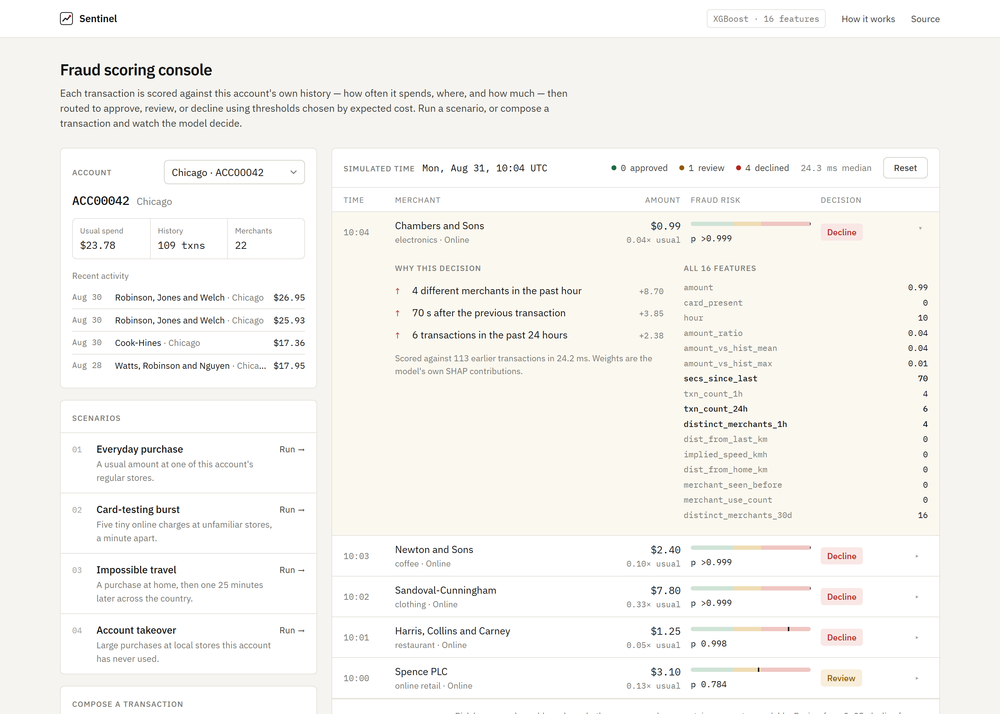
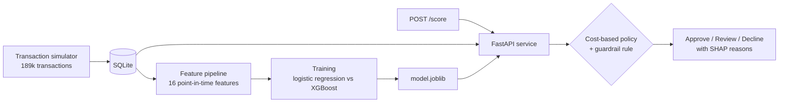

# Sentinel

**Real-time card fraud detection: a scoring service that decides approve, review, or decline in about 14 ms, and shows why.**

[**Live demo**](https://sentinel-pm60.onrender.com) ·
[**Watch a card-testing attack get caught**](https://sentinel-pm60.onrender.com/?scenario=burst&expand) ·
[How it works](#how-it-works) ·
[Run locally](#run-locally)



<sub>A card-testing burst: five tiny online charges a minute apart. The first goes to review; as the
pattern emerges, the next four are declined. The expanded row shows the model's own reasons.
The demo runs on a free tier, so the first visit after a quiet spell takes about a minute to wake up.</sub>

---

## Highlights

- **End-to-end system**, not a notebook: transaction simulator → point-in-time feature pipeline →
  model training and selection → cost-based decision policy → FastAPI service → browser console, deployed.
- **Leakage-proof features.** All 16 features are built only from an account's *prior* transactions,
  with a time-based train/test split. A label-shuffle control confirms it: PR-AUC drops from
  **0.895 to 0.012**, the level of random guessing.
- **Thresholds chosen by business cost, not by default.** Sweeping cut-offs against asymmetric costs
  ($200 per missed fraud, $50 per wrongly declined customer) cuts modelled loss by **52%** compared
  with the usual 0.5 threshold.
- **Training/serving consistency.** Features are computed two different ways, in batch for training
  and live for serving, and a parity test checks that they agree on **3,216 of 3,216** values.
- **Explainable decisions.** Every decision lists its top reasons, taken from the model's exact
  SHAP contributions rather than hand-written text.
- **Tested adversarially.** Probing the live service with hand-built transactions found two real
  failure modes, both fixed and documented [below](#validation).

## Results

Evaluated on the final 20% of the timeline: 37,846 transactions, 288 of them fraud (0.76%).

| model | PR-AUC |
|---|---|
| random guessing (the fraud rate) | 0.008 |
| logistic regression (baseline) | 0.755 |
| **XGBoost** | **0.895** |
| XGBoost trained on shuffled labels (leakage control) | 0.012 |

| fraud pattern | caught (p ≥ 0.5) | caught or sent to review |
|---|---|---|
| card testing | 94% | 96% |
| impossible travel | 72% | 96% |
| account takeover | 57% | 80% |
| **false positive rate** | **0.04%** | |

<p align="center"></p>

**Why PR-AUC and not accuracy?** Only 1 transaction in 131 is fraud, so a model that always answers
"not fraud" is 99.2% accurate and completely useless. PR-AUC measures how well the model ranks the
rare fraud cases above everything else, and it penalises false alarms properly at this level of
imbalance. ROC-AUC would look flattering here for the same reason.

## How it works



### 1. Data

Public card-fraud datasets are anonymised into principal components, with no account, merchant,
time or location. That makes behavioural features impossible to build. So Sentinel generates its
own world: **2,000 accounts** and **300 merchants** across 8 US cities, with **189,230 transactions
over 90 days**. Each account has its own typical spend, five regular stores it uses 80% of the time,
and occasional trips to other cities.

Three fraud patterns are planted (1,255 transactions, 0.66%), each deliberately built to overlap
with normal behaviour so that no single rule can separate them:

| pattern | what happens | what gives it away |
|---|---|---|
| **card testing** | 6–20 tiny online charges within minutes at unfamiliar stores | burst rate, many merchants per hour |
| **impossible travel** | a purchase in another city 20–90 minutes after a genuine one | distance ÷ time since last purchase |
| **account takeover** | 3–8 purchases at 1.5–8× normal spend at never-used stores | amount vs. the account's norm, unfamiliar merchant |

<p align="center"></p>

### 2. Features without leakage

Every feature describes a transaction *relative to that account's own history*, such as spend
compared with its usual amount, transactions in the past hour, implied travel speed, or whether it
has used this merchant before. The model never learns anything about specific customers, so a
brand-new account can be scored immediately.

Each feature is computed only from transactions **strictly before** the one being scored, and the
data is split by time (first 80% trains, last 20% tests), never randomly. This is verified rather
than assumed: the first charge of a card-testing burst sees 0.07 prior transactions in the past
hour, the same as a normal purchase, while later charges see 6.9. A leaking pipeline would let the
first charge see its own burst.

### 3. Model selection

Logistic regression was trained first as a baseline, so XGBoost's gain would be measured rather
than assumed. XGBoost improves PR-AUC from 0.755 to 0.895, mainly by capturing **interactions** a
linear model cannot represent: a large purchase is normal at a store the customer uses every week,
and suspicious at one they have never visited.

### 4. Choosing the thresholds

The model outputs a probability, and turning it into a decision needs a cut-off. Because a missed
fraud costs 4× a false decline, the cheapest single threshold is **0.11**, not 0.5:

<p align="center"></p>

Two thresholds then give a three-way policy, so that uncertain cases go to a person instead of
being blocked or waved through:

| decision | probability | transactions | outcome |
|---|---|---|---|
| APPROVE | below 0.05 | 37,478 | 33 frauds missed |
| REVIEW | 0.05 – 0.85 | 179 (0.5% of volume) | 71 frauds caught by an analyst |
| DECLINE | 0.85 and above | 189 | only 5 legitimate customers blocked |

Total modelled cost is **$7,745, against $16,200** at a fixed 0.5 threshold.

### 5. Real-time serving

A live request carries a single transaction and no history, so the service rebuilds the 16
features on the fly. Each account's history is loaded from SQLite once and then kept in memory,
and every scored transaction is appended, so a burst builds on itself exactly as in the demo. Each
visitor gets an isolated history, so people using the demo at the same time never affect each
other.

Because training and serving compute features in two different ways, `test_parity.py` checks that
they agree on every value for a sample covering all three fraud patterns. Median latency is
**14 ms** (p95 17 ms).

Two layers sit on top of the model:

- **Explanations.** XGBoost's `pred_contribs` returns each feature's exact contribution to a
  score. The top three are shown as plain-English reasons for every decision.
- **A guardrail rule.** Tree models cannot extrapolate beyond the values they were trained on, so
  amounts above 12.75× an account's usual spend (the largest seen in training) go to review, and
  above 38× are declined. The rule can only make a decision stricter.

## Validation

Beyond the metrics, the service was probed with hand-built transactions, changing one variable at a
time. This found two problems that aggregate scores had hidden:

1. **A leak in the simulator.** Account-takeover fraud had been drawing merchants from every city,
   so the model learned "far from home" instead of "unusual amount at an unfamiliar store", and a
   $150 charge (6× usual spend) at a never-used local shop was approved. After the generator was
   fixed, the same charge goes to review. PR-AUC fell from 0.961 to 0.895, the honest figure once
   the shortcut was removed.
2. **No extrapolation.** A $20,000 charge scored the same as a $500 one, because no training
   example went that high. A monotonic constraint was tried first and made results worse (fraud
   risk is U-shaped in amount: tiny charges are card testing, huge ones are takeover), so the
   guardrail rule above was added instead. It affects 1 in 37,846 test transactions.

## Limitations

- **The data is synthetic.** The model can only recover patterns that were generated, so these
  figures describe what the pipeline can do, not how it would perform on real card traffic, where
  fraud adapts and labels arrive weeks late through chargebacks.
- **The cost figures are assumptions.** $200, $50, and $5 per review are the right kind of input
  for this decision, but the values are illustrative.
- **Large charges at regular stores are trusted.** Simulated takeover fraud never uses an account's
  own stores, so within the training range a big purchase at a familiar merchant can be approved.
  Planting that case in the simulator would teach the model directly.
- **The live history lives in one process.** It resets on restart and would need a shared store,
  such as Redis, to run on several servers.

## Tech stack

**Python** · **FastAPI** · **XGBoost** · **scikit-learn** · **pandas** · **SQLAlchemy** · **SQLite** ·
vanilla **JavaScript** · deployed on **Render**

## Run locally

```bash
git clone https://github.com/rasxim/sentinel.git && cd sentinel
pip install -r requirements.txt

python init_db.py && python generate_data.py   # build the synthetic world  (~1 min)
uvicorn main:app                               # open http://127.0.0.1:8000
```

`model.joblib` is committed, so the steps above are enough to run the console. To reproduce the
training and every figure in this README:

```bash
python features.py      # build the feature table  (~3 min)
python train.py         # baseline, XGBoost, shuffle control
python cost_curve.py    # threshold sweep
python make_charts.py   # figures
python test_parity.py   # training/serving feature parity
```

<details>
<summary><b>Project structure</b></summary>

```
generate_data.py    synthetic accounts, merchants, transactions and planted fraud
features.py         16 point-in-time features (batch, for training)
train.py            time-based split, logistic regression, XGBoost, shuffle control
cost_curve.py       threshold sweep and three-way policy
main.py             FastAPI service: live features, scoring, rule, explanations, API
static/             browser console (HTML, CSS, JavaScript)
test_parity.py      checks that batch and live features agree
make_charts.py      README figures
db.py, models.py    SQLAlchemy engine and schema
render.yaml         deployment config
```

</details>

<details>
<summary><b>API</b></summary>

| endpoint | purpose |
|---|---|
| `POST /score` | score one transaction and return the decision, probability, reasons and all 16 features |
| `GET /accounts`, `GET /accounts/{id}` | demo accounts and their profiles |
| `POST /reset` | clear this visitor's live history |
| `GET /meta` | thresholds and rule limits |
| `GET /docs` | interactive API documentation |

</details>

---

Built by [@rasxim](https://github.com/rasxim).
